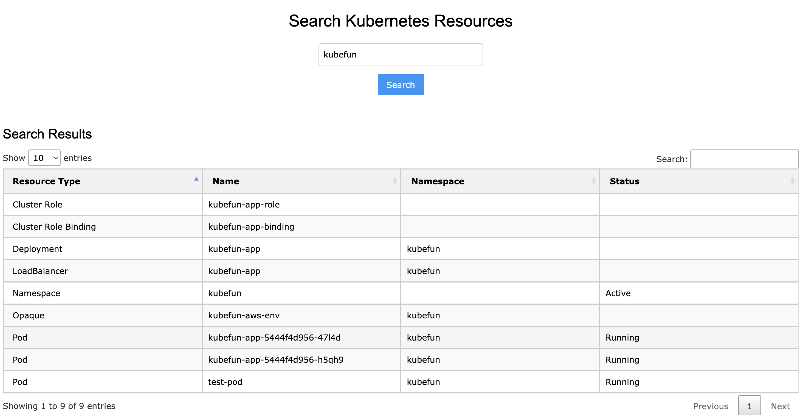
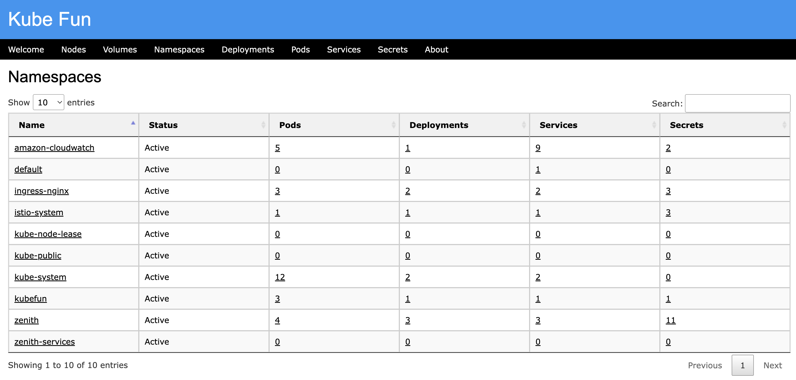

# Kubefun

Kubefun is a lightweight and intuitive Kubernetes resource explorer that provides insights into cluster resources and their relationships. It offers an interactive interface to search, view, and navigate through various Kubernetes resources, making it an essential tool for developers and operators.

---

## Features

- **Global Search**: Search for a keyword to find related resources, including:
  - Namespaces
  - Deployments
  - Pods
  - Services
  - Secrets
  - StorageClasses
  - CRDs
  - Cluster Roles and Role Bindings
- **Detailed Views**: Access detailed information about individual resources such as Pods, Deployments, Services, Secrets, and more.
- **Cluster Overview**: Get a high-level summary of your Kubernetes cluster, including node health, resource counts, and namespace-level details.
- **Interactive Navigation**: Use hyperlinks to explore related resources seamlessly.
- **User-Friendly Design**: Built with simplicity and efficiency in mind, Kubefun is accessible for Kubernetes users of all skill levels.

---

## Installation

### Using Docker

1. **Build the Docker image**:
   ```bash
   docker build -t kubefun .
   ```

2. **Run the Docker container**:
   ```bash
   docker run -d -p 39027:5000 \
       -e AWS_PROFILE=default \
       -v ~/.aws:/root/.aws \
       -v ~/.kube/config:/root/.kube/config:ro \
       kubefun
   ```

3. **Access the application**:
   Open your browser and navigate to `http://localhost:39027`.

---

### Deploying to Kubernetes

1. **Build and push your Docker image**:
   ```bash
   docker tag kubefun <your-dockerhub-repo>/kubefun:latest
   docker push <your-dockerhub-repo>/kubefun:latest
   ```

2. **Deploy with `kubectl` and `kustomize`**:
   #### AWS EKS Deployment

   - Create namespace kubefun
   ```bash
   kubectl create namespaces kubefun
   ```

   - Create secret with your credentials

   ```bash
   kubectl create secret generic kubefun-aws-env \
      --from-literal=AWS_PROFILE=default \
      --from-literal=AWS_SSO_SESSION=apps-k8s-dev \
      -n kubefun
   ```

   - Deploy to dev

   ```bash
   kubectl apply -k overlays/dev
   ```
   
3. **Access the application**:
   - If using a **LoadBalancer**, get the external IP:
     ```bash
     kubectl get svc -n kubefun
     ```
   - If using **NodePort**, use the Node's external IP and the port specified in the Service.

---

## Screenshots

Here’s a preview of Kubefun in global search:



Here’s a preview of Kubefun in overview of resources in namespaces:




---

## Resources

- **GitHub Repository**: [Kubefun GitHub](https://github.com/your-repo)
- **DockerHub Image**: [Kubefun DockerHub](https://hub.docker.com/r/your-docker-image)

---

## References

- [Kubernetes Python Client](https://github.com/kubernetes-client/python)
- [Kubernetes API Reference](https://kubernetes.io/docs/reference/kubernetes-api/)

---

## Contributing

Contributions are welcome! To get started:

1. **Fork this repository**.
2. **Create a new branch**:
   ```bash
   git checkout -b feature/your-feature
   ```
3. **Commit your changes**:
   ```bash
   git commit -m "Add your feature"
   ```
4. **Push the branch**:
   ```bash
   git push origin feature/your-feature
   ```
5. **Open a pull request**.

---

## License

Kubefun is licensed under the [GNU GENERAL PUBLIC LICENSE v3 ](LICENSE).

---

## Contact

For any questions or feedback, feel free to reach out via GitHub issues or contact the maintainer.
